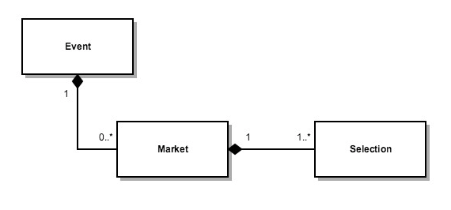
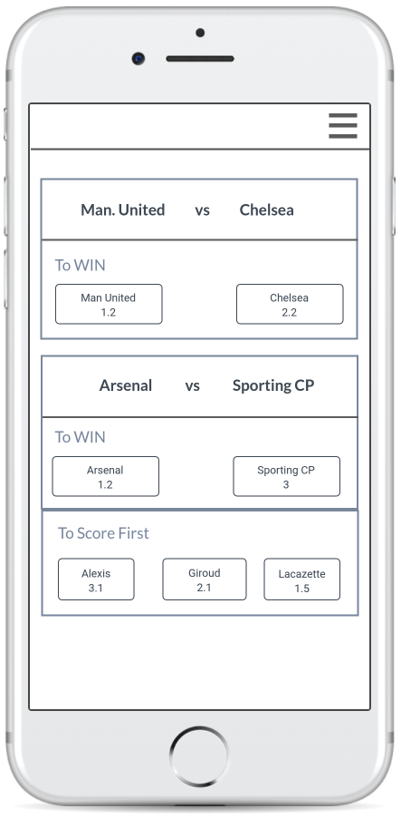
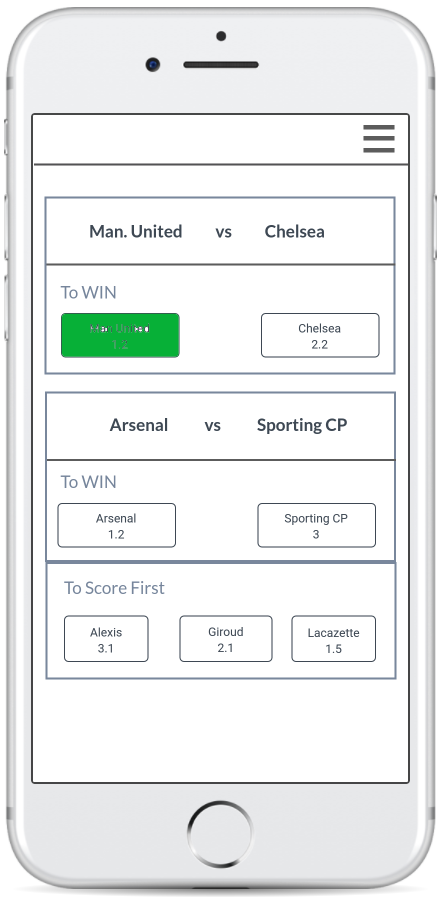
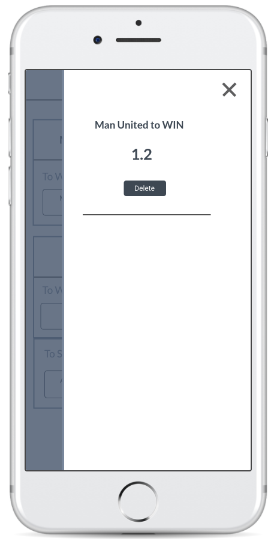

 # Initial thoughts
* Project made using **React + Typescript**, granting type/interface support and validation (speeding up code development and avoiding type-related mistakes)
* **Error handling** and **loading state** both implemented
* **Side menu**: opening animation, dismiss modal clicking both on close icon and grey background
* **Unit testing** using React @testing-library (just to try it out)
# Running this project locally

In the project directory, you can run:
### `npm start` to start your local server

Runs the app in the development mode.\
Open [http://localhost:3000](http://localhost:3000) to view it in the browser.

The page will reload if you make edits.\
You will also see any lint errors in the console.

### `npm test` to run unit testing

Launches the test runner in the interactive watch mode.\
See the section about [running tests](https://facebook.github.io/create-react-app/docs/running-tests) for more information.

This project was bootstrapped with [Create React App](https://github.com/facebook/create-react-app).

# Challenge : Addison Global Frontend Technical Assessment

## Introduction

Welcome to Addison Global Frontend Tech test.

The primary goal of this exercise is to assess how you reason about your ability to write clean, well tested and reusable code. There's no hard rules or tricky questions.

**We hope you have fun.**

## Glossary
* Event - A sports event. A football match between Real Madrid and Barcelona for instance. **An event has 0 or more markets.**
* Market - A betting opportunity available for a specific event. "Team to win" or "Player to Score First" are possible examples of a market.
* Selection - A possible outcome for the market which has a price associated with it. Example: "Real Madrid to win at 1.25" or "Ronaldo to score first at 1.15".
* Betslip - The list of selections added by the user. You can think of this as the shopping cart.

## Brief
This exercise is comprised of two views:
* Event List - a list of events, markets and selections
* Betslip - List of selections that the user is betting on

When the page loads, you should fetch the data to render the **event list**. Each event must contain the event name and a list of markets associated with that event. For each of those markets, its name should be displayed alongside a button for each associated selection. Please see the [screens section](#screens) for more details.

**Please be aware that an event may have 0 markets and in that case, the event should be ignored (not displayed).** For the purpose of this exercise, you can consider that every market has at least one selection.

When a selection on the event list is clicked, it should change its color to green. Also, you should add it on the betslip by displaying its name, price and a remove button.

When the remove button for a selection in the betslip is clicked, the selection should be removed from the betslip, and the corresponding button on the event list should switch to its default color. The same behaviour should apply when a user clicks on a previously added selection (green button) on the event list.

## Data

We've provided an endpoint that can be accessed in the following URL:
<a href="http://www.mocky.io/v2/59f08692310000b4130e9f71" target="_blank">http://www.mocky.io/v2/59f08692310000b4130e9f71</a>



**Although our endpoint provides hierarchical data, we suggest you normalize the data in a way that's more convenient for your application.** Please provide justification for your choice.

You can also find a sample of the data [data.json](data.json)

### Types

```js
/** The response type of the API call */
type ResponseType = EventsType[];

/** Event Entity */
type EventType = {
    id: string;
    name: string;
    markets: MarketType[];
};

/** Market Entity */
type MarketType = {
    id: string;
    name: string;
    markets: SelectionType[];
}

/** Selection Entity */
type SelectionType = {
    id: string;
    name: string;
    price: number;
}
```

## Technology

At Addison Global, we're big fans of React. Our stack consists of React (with hooks), TypeScript, XState, RxJS, Ramda, CSS in JS with Emotion. We are using Cypress for integration tests and Jest for unit tests. We encourage you to solve the task in this stack, if you're comfortable with it. Solutions using React are preferred. <a href="https://github.com/facebookincubator/create-react-app" target="_blank">create-react-app</a> is a standard option to create a new React project and you are free to use it if you choose to.

You're also free to use a component library to get you started and any other package that you find required.

Static type checking is a great way to introduce additional level of safety into your code and we welcome solutions written in TypeScript (or Flow, if you are more familiar with it).

**Despite the above stack, we accept answers using different choices of libraries as long as you keep React.js.**

We like to write clean code using proper programming patterns and JavaScript best practices and expect you to strive to do the same.

## Screens
> You can find a prototype outlining the basic functionality here:
<a href="https://marvelapp.com/2c4f5ia/screen/33947906" target="_blank">Prototype</a>

**The provided screens are a wireframe, not a final design for the application.** You are expected to implement the user interface by yourself. The use of component libraries, like Material UI, might make this easier for you and is encouraged.

### Event List View

* Initial View



* After a selection has been added



### Betslip View

* Empty


* With Selections



## Tests

We expect you to provide tests alongside your code. The minimum requirement is that the code will be unit tested. End to end tests are a big plus. From our experience Cypress.js works very well for React application testing, but you're free to pick your favourite.

## The Deliverable

* A bundled/archived repository showing your commit history or a link to an accessible private repository with your work in (Github can host personal private repositories for free). Git example for sending us a standalone bundle:

        git bundle create <yourname>.bundle --all --branches

* A README.md file explaining the decisions you've made solving this task including technology and library choices.
* Any instructions required to run your solution and tests in a Linux environment.